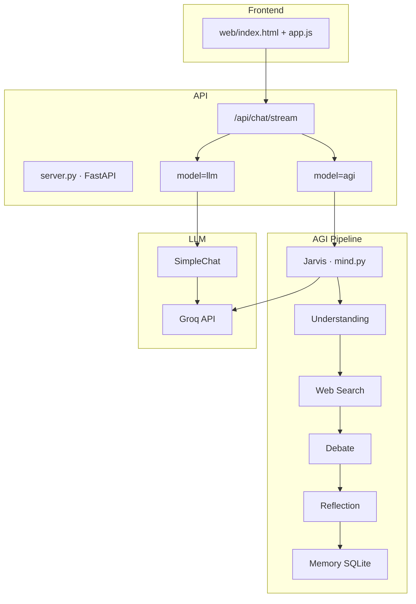

# ZamanAI

**Персональная AI-платформа с двумя режимами интеллекта: быстрый LLM и полноценный AGI-пайплайн.**

[](https://www.python.org/)
[](https://fastapi.tiangolo.com/)
[](https://groq.com/)
[](LICENSE)

---

## О проекте

ZamanAI — это веб-платформа и когнитивная архитектура AGI-ассистента **Джарвис**. Пользователь выбирает режим:

| Режим | Описание |
|-------|----------|
| **LLM** | Прямой ответ через Groq. Быстро, для повседневных задач. |
| **AGI** | Полный цикл мышления: понимание → поиск → ассоциации → дебаты → сомнение → рефлексия → память. |

Интерфейс в стиле iOS 27: адаптивная вёрстка под ПК, планшет и телефон, SSE-стриминг этапов мышления в реальном времени.

---

## Архитектура



---

## Структура проекта

```
zamanai.AGI/
├── jarvis_app.py          # Запуск веб-сервера
├── server.py              # FastAPI: API + статика
├── main.py                # Консольный режим
├── web/
│   ├── index.html
│   ├── css/style.css
│   ├── js/app.js
│   └── assets/logo.png
└── zamanai/
    ├── mind.py            # Jarvis — оркестратор AGI
    ├── simple_chat.py     # Обычный LLM
    ├── consciousness.py   # Global Workspace Theory
    ├── groq_client.py     # Groq API
    └── modules/           # Когнитивные модули
        ├── understanding.py
        ├── debate.py
        ├── reasoning.py
        ├── doubt.py
        ├── reflection.py
        ├── memory.py
        └── web_search.py
```

---

## Быстрый старт

### 1. Клонирование

```bash
git clone https://github.com/baelaslanbekow/zamanai.git
cd zamanai
```

### 2. Зависимости

```bash
python3 -m venv .venv
source .venv/bin/activate
pip install -r requirements.txt
```

### 3. Конфигурация

```bash
cp .env.example .env
```

Добавьте ключ Groq в `.env`:

```env
GROQ_API_KEY=your_groq_api_key_here
```

### 4. Запуск локально

```bash
python3 jarvis_app.py
```

Откроется `http://127.0.0.1:5050`

Консольный режим: `python3 main.py`

---

## Деплой (работает в интернете)

ZamanAI использует два слоя:

| Слой | Где | URL |
|------|-----|-----|
| Фронтенд | GitHub Pages | https://baelaslanbekow.github.io/zamanai/ |
| Бэкенд (API + AGI) | Render (бесплатно) | https://zamanai.onrender.com |

### Шаг 1 — GitHub Pages (автоматически)

При каждом `push` в `main` GitHub Actions публикует сайт на Pages.

### Шаг 2 — Render (один раз, 2 минуты)

1. Нажмите кнопку:

[](https://render.com/deploy?repo=https://github.com/baelaslanbekow/zamanai)

2. В Render добавьте переменную **`GROQ_API_KEY`** (ваш ключ с [console.groq.com](https://console.groq.com))
3. Нажмите **Deploy**

После деплоя сайт на GitHub Pages будет отправлять запросы на `https://zamanai.onrender.com`.

> Render free tier «засыпает» после 15 мин бездействия — первый запрос может занять ~30 сек.

---

## API

| Endpoint | Метод | Описание |
|----------|-------|----------|
| `/` | GET | Веб-интерфейс |
| `/api/health` | GET | Статус сервера |
| `/api/chat/stream` | POST | Чат со SSE-стримингом |
| `/api/memory` | GET | Статистика памяти AGI |

**Пример запроса:**

```json
{
  "message": "Объясни разницу между LLM и AGI",
  "model": "agi",
  "history": [],
  "show_thoughts": true
}
```

---

## AGI-пайплайн

1. **Understanding** — разбор вопроса
2. **Web Search** — поиск актуальной информации
3. **Perception** — оценка срочности и контекста
4. **Association** — связь с памятью
5. **Monologue** — внутренний монолог
6. **Debate** — спор «в голове» (deep/expert)
7. **Reasoning** — логическое рассуждение
8. **Doubt** — самокритика
9. **Reflection** — улучшение ответа
10. **Self Review** — финальная проверка
11. **Memory** — сохранение в SQLite

---

## Стек

- **Backend:** Python 3.11, FastAPI, Uvicorn
- **AI:** Groq API (Llama 3.1)
- **Frontend:** Vanilla JS, CSS, SSE
- **Память:** SQLite
- **Поиск:** DuckDuckGo (ddgs)

---

## Автор

**Bayel Aslanbekov** — AI-Native Backend Engineer

- GitHub: [@baelaslanbekow](https://github.com/baelaslanbekow)
- Портфолио: [baelaslanbekow.github.io/portfolio-2026](https://baelaslanbekow.github.io/portfolio-2026/)
- Telegram: [@kyrgyz4](https://t.me/kyrgyz4)

---

## Лицензия

MIT — см. [LICENSE](LICENSE)
